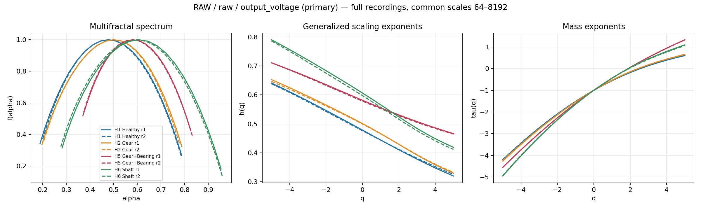
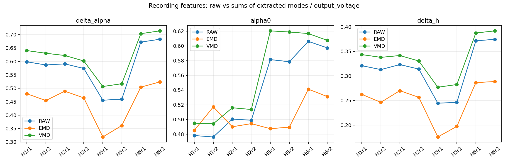
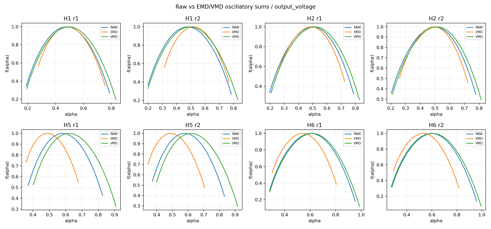

# Bước 4: PHM2009 raw, EMD, VMD và MF-DFA

Dữ liệu: 8 recording Helical, 50 Hz, High load; cột 2 chính, cột 1 đối chiếu.
Giữ nguyên toàn bộ mỗi recording. Mỗi recording là một đơn vị so sánh độc lập, không nối dữ liệu.

**Lưu ý từ dữ liệu thực:** các đường Fq(s) đổi độ dốc và bão hòa. Fit 64–8.192 mẫu không phải một vùng power-law rõ ràng trên mọi recording. Đọc các chỉ số như đặc trưng thực nghiệm của cấu hình này, chưa coi chúng là bằng chứng multifractality ổn định.

## Raw MF-DFA: cột 2

| Recording | Δα | α0 | Δh | min R² |
|---|---:|---:|---:|---:|
| helical_1_50hz_High_1 | 0.598901 | 0.478389 | 0.320992 | 0.6732 |
| helical_1_50hz_High_2 | 0.587090 | 0.476424 | 0.313020 | 0.6701 |
| helical_2_50hz_High_1 | 0.591170 | 0.500705 | 0.323215 | 0.7478 |
| helical_2_50hz_High_2 | 0.573999 | 0.499170 | 0.314089 | 0.7564 |
| helical_5_50hz_High_1 | 0.455866 | 0.581584 | 0.244693 | 0.8899 |
| helical_5_50hz_High_2 | 0.459673 | 0.578615 | 0.246290 | 0.8803 |
| helical_6_50hz_High_1 | 0.672211 | 0.606336 | 0.371509 | 0.8534 |
| helical_6_50hz_High_2 | 0.682803 | 0.597439 | 0.374686 | 0.8525 |

Đổi vùng fit từ 64–8.192 sang 256–4.096 mẫu làm α0 cột 2 thay đổi tối đa 0.2459. Do đó vị trí đỉnh phổ nhạy đáng kể với vùng scaling.



## Khác biệt giữa trạng thái ở baseline

Dưới đây chỉ mô tả hai lần đo mỗi trạng thái. Hai khoảng giá trị không giao nhau chưa phải bằng chứng thống kê về khả năng chẩn đoán tổng quát.

- H1 vs H2: khoảng của hai lần đo tách nhau ở alpha0.
- H2 vs H5: khoảng của hai lần đo tách nhau ở delta_alpha, alpha0, delta_h.
- H2 vs H6: khoảng của hai lần đo tách nhau ở delta_alpha, alpha0, delta_h.

## So sánh EMD với raw và VMD

Một số mode hẹp băng có h(q)≤0 trên dải fit, và Fq(s) không biểu hiện một power-law dương ổn định. MF-DFA chuẩn có giới hạn trong trường hợp h gần zero/âm (Kantelhardt, mục 2, trước công thức 7). Các f(alpha) này được lưu đúng phép tính nhưng không diễn giải thành phổ kỳ dị vật lý đã được xác nhận. all_features.csv ghi minimum_hq, nonpositive_hq_count và cảnh báo fit.

Các bảng so sánh dùng đúng cùng recording/kênh/q/scales. Mỗi mode, tổng mode và residual đều lưu riêng. Bảng dưới đếm số chỉ số có khoảng hai lần đo không giao nhau (0–3), chỉ mang tính mô tả trên tám recordings.

| Component | Pipeline | H1–H2 | H2–H5 | H2–H6 |
|---|---|---:|---:|---:|
| raw | RAW | 1 | 3 | 3 |
| mode1 | EMD | 1 | 3 | 1 |
| mode1 | VMD | 3 | 3 | 3 |
| mode2 | EMD | 1 | 3 | 3 |
| mode2 | VMD | 3 | 3 | 3 |
| mode3 | EMD | 1 | 3 | 2 |
| mode3 | VMD | 3 | 3 | 3 |
| mode4 | EMD | 0 | 3 | 0 |
| mode4 | VMD | 2 | 3 | 3 |
| mode5 | EMD | 2 | 3 | 1 |
| mode5 | VMD | 3 | 3 | 3 |
| mode6 | EMD | 3 | 3 | 1 |
| mode6 | VMD | 3 | 3 | 3 |
| oscillatory_sum | EMD | 0 | 3 | 3 |
| oscillatory_sum | VMD | 2 | 3 | 3 |





paired_pipeline_comparisons.csv ghi chênh Δα, α0, Δh từng recording cho raw–EMD, EMD–VMD và raw–VMD, cả từng mode lẫn tổng mode. Các hình paired_rank* đặt phổ raw/EMD/VMD cùng một panel theo rank tần số.

Bảng đếm trên không đủ để xếp hạng giải thuật: mode ở cùng rank có thể khác dải tần, có mode h(q)≤0/fit kém, VMD tau=0 chủ động loại một phần tín hiệu, và chỉ có hai recording mỗi trạng thái.

## Trạng thái decomposition

| Pipeline | Recording/kênh | Mode | Hội tụ/dừng | Sai số tổng mode so với raw đã trừ mean |
|---|---|---:|---|---:|
| EMD | helical_1_50hz_High_1 / output_voltage | 6 | max_imfs | 0.274464 |
| EMD | helical_1_50hz_High_1 / input_voltage | 6 | max_imfs | 0.289433 |
| EMD | helical_1_50hz_High_2 / output_voltage | 6 | max_imfs | 0.245519 |
| EMD | helical_1_50hz_High_2 / input_voltage | 6 | max_imfs | 0.282680 |
| EMD | helical_2_50hz_High_1 / output_voltage | 6 | max_imfs | 0.236204 |
| EMD | helical_2_50hz_High_1 / input_voltage | 6 | max_imfs | 0.248299 |
| EMD | helical_2_50hz_High_2 / output_voltage | 6 | max_imfs | 0.234720 |
| EMD | helical_2_50hz_High_2 / input_voltage | 6 | max_imfs | 0.253723 |
| EMD | helical_5_50hz_High_1 / output_voltage | 6 | max_imfs | 0.172282 |
| EMD | helical_5_50hz_High_1 / input_voltage | 6 | max_imfs | 0.569977 |
| EMD | helical_5_50hz_High_2 / output_voltage | 6 | max_imfs | 0.161758 |
| EMD | helical_5_50hz_High_2 / input_voltage | 6 | max_imfs | 0.580220 |
| EMD | helical_6_50hz_High_1 / output_voltage | 6 | max_imfs | 0.283826 |
| EMD | helical_6_50hz_High_1 / input_voltage | 6 | max_imfs | 0.600841 |
| EMD | helical_6_50hz_High_2 / output_voltage | 6 | max_imfs | 0.278719 |
| EMD | helical_6_50hz_High_2 / input_voltage | 6 | max_imfs | 0.600260 |
| VMD | helical_1_50hz_High_1 / output_voltage | 6 | converged | 0.200739 |
| VMD | helical_1_50hz_High_1 / input_voltage | 6 | converged | 0.139387 |
| VMD | helical_1_50hz_High_2 / output_voltage | 6 | converged | 0.203320 |
| VMD | helical_1_50hz_High_2 / input_voltage | 6 | converged | 0.140169 |
| VMD | helical_2_50hz_High_1 / output_voltage | 6 | converged | 0.257583 |
| VMD | helical_2_50hz_High_1 / input_voltage | 6 | converged | 0.147530 |
| VMD | helical_2_50hz_High_2 / output_voltage | 6 | converged | 0.259155 |
| VMD | helical_2_50hz_High_2 / input_voltage | 6 | converged | 0.148217 |
| VMD | helical_5_50hz_High_1 / output_voltage | 6 | converged | 0.357420 |
| VMD | helical_5_50hz_High_1 / input_voltage | 6 | converged | 0.204162 |
| VMD | helical_5_50hz_High_2 / output_voltage | 6 | converged | 0.355457 |
| VMD | helical_5_50hz_High_2 / input_voltage | 6 | converged | 0.213518 |
| VMD | helical_6_50hz_High_1 / output_voltage | 6 | converged | 0.227039 |
| VMD | helical_6_50hz_High_1 / input_voltage | 6 | converged | 0.138774 |
| VMD | helical_6_50hz_High_2 / output_voltage | 6 | converged | 0.232131 |
| VMD | helical_6_50hz_High_2 / input_voltage | 6 | converged | 0.139002 |

## Thiết lập chung và diễn giải

- q = -5, -4.5, ..., 5; DFA2; 40 scales log từ 64 đến 8.192 mẫu cho tất cả recordings và components.
- MF-DFA sử dụng toàn bộ tín hiệu, trừ mean khi tạo profile và detrending từng đoạn từ cả hai đầu. Không resample, lọc, chuẩn hóa biên độ hoặc cắt các recording về cùng chiều dài.
- α0 = α(q=0), tương ứng f(α0)=1 theo công thức tau(0)=-1. Δα=max(α)-min(α), Δh=max(h)-min(h) trên dải q đã cho; không ngoại suy ra q vô hạn.
- Đã tính thêm cùng tập scales với vùng fit 256–4.096 mẫu, lưu các chỉ số *_sensitivity. Xem Fq(s), R² và tính nhạy theo vùng fit trước khi diễn giải phổ như một luật scaling duy nhất.
- EMD/VMD chỉ trừ global mean trước decomposition. EMD dùng biến thể dừng thực hành trong compare/emd_long_record.py: tối đa 6 mode, relative energy SD≤0,2, mean envelope RMS ratio≤0,05, chênh cực trị/đổi dấu≤0,5%, cap 200 sifting. Báo riêng điều kiện chính xác chênh≤1 và cờ hội tụ cho mỗi mode.
- Chạy thử EMD gốc (core, pointwise SD tổng≤0,2 và count mismatch≤1) trên H1 output không hội tụ sau 1.000 sifting và trả 0 IMF. Chi tiết được giữ tại strict_emd_pilot.json. Cấu hình thực hành giữ các mode xấp xỉ; chúng không được trình bày như IMF Huang chính xác. Candidate chạm cap vẫn được lưu/phân tích với cờ chưa hội tụ, không che bỏ.
- VMD cố định K=6, alpha=2.000, tau=0, init=1, tol=1e-7, cap 2.000. tau=0 là denoising: tổng mode có thể khác raw, nên giữ và báo residual, reconstruction error và convergence.
- Mỗi mode chạy MF-DFA riêng. Đánh số mode theo tần số centroid giảm dần; cùng rank không bảo đảm cùng cơ chế vật lý giữa EMD và VMD hoặc giữa trạng thái.
- oscillatory_sum = tổng các mode đã trích, rồi chạy lại MF-DFA trên tổng này. Không cộng/trung bình Fq, h hoặc f(alpha) của các mode. So sánh recording raw–EMD–VMD ở biểu đồ tổng này.
- EMD oscillatory_sum chỉ gồm sáu mode đầu, nên không phải tái tạo đầy đủ raw; phần thấp tần còn lại ở residue. VMD sum cũng khác raw vì tau=0. Sai số bảng decomposition là sai số tổng mode, còn mode + residue tái tạo tín hiệu đã trừ mean trong giới hạn làm tròn.
- residue được phân tích riêng khi scaling xác định; undefined được ghi rõ trong features.csv. Không tự gán chỉ số cho chuỗi zero/đã detrend hoàn toàn.
- Không chọn K, scales hoặc mode bằng cách tối đa hóa khác biệt giữa nhãn. Đây là baseline với cấu hình chung, chưa phải đánh giá classifier.

## Cấu trúc và nhãn dataset

VidData.xls / Sheet1: A17:M22 mô tả trạng thái Helical; B41 ghi sample rate 66.6667 KHz; B34 ghi mỗi acquisition 4 Seconds; A35 ghi hai acquisitions mỗi operating speed/load.
H1: tất cả Good. H2: gear 24T Chipped. H5: gear 24T Broken và bearing ID:OS Inner. H6: Input shaft Bent Shaft. Vì mức hỏng gear H2 và H5 khác nhau, H2↔H5 không cô lập riêng tác động thêm bearing.
Các file TXT không có header, có ba cột số. Tên cột input/output voltage/tachometer theo mô tả người dùng; VidData còn mô tả accelerometers Endevco 6259M31, 10mv/g. Giữ đơn vị voltage, không đổi sang g khi chưa có đầy đủ calibration.
Bảy file dài 266.656 mẫu (xấp xỉ 4 s), H5 repeat 2 dài 245.648 mẫu (xấp xỉ 3,685 s). Số mẫu thực tế được giữ nguyên. 50 Hz là operating speed, không phải sample rate.

## File kết quả và chạy lại

- raw_mfdfa: features.csv (16 hàng), NPZ/CSV phổ từng recording/kênh, spectrum và scaling plots, source_inventory.json, viddata_extracted.json, config.json.
- emd_mfdfa, vmd_mfdfa: decomposition NPZ, diagnostics JSON, MF-DFA NPZ/CSV mỗi mode/sum/residue, features.csv, plots theo mode và kênh.
- compare: all_features.csv, paired_pipeline_comparisons.csv (EMD–raw, EMD–VMD và raw–VMD theo từng recording), state_pair_comparisons.csv, validation.json và báo cáo này.
- Dữ liệu nguồn và code/core chỉ được đọc. SHA256 tám file raw được kiểm tra lại sau phân tích.
- raw_formula_validation.json: 27 phép đối chiếu Fq(s) trên dữ liệu thật bằng vòng lặp polyfit độc lập; practical_emd_tests.json: 4 kiểm thử biến thể EMD; validation.json và decomposition_validation.json: kiểm tra từng kết quả và đẳng thức mode + residue.

```powershell
python -B result\test\step4\compare\run_step4.py all
```
Có thể chạy riêng raw, emd, vmd hoặc compare. Decomposition cache chỉ được dùng khi hash dữ liệu và toàn bộ cấu hình khớp.

Môi trường: Python 3.13.4, NumPy 2.2.6, SciPy 1.18.1, Matplotlib 3.10.8.
