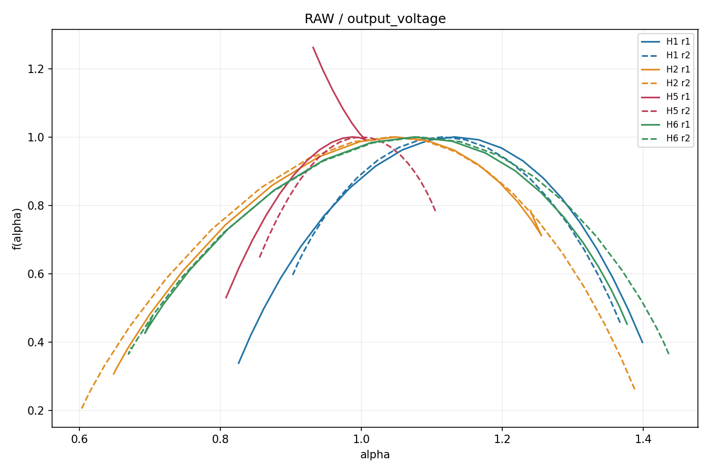
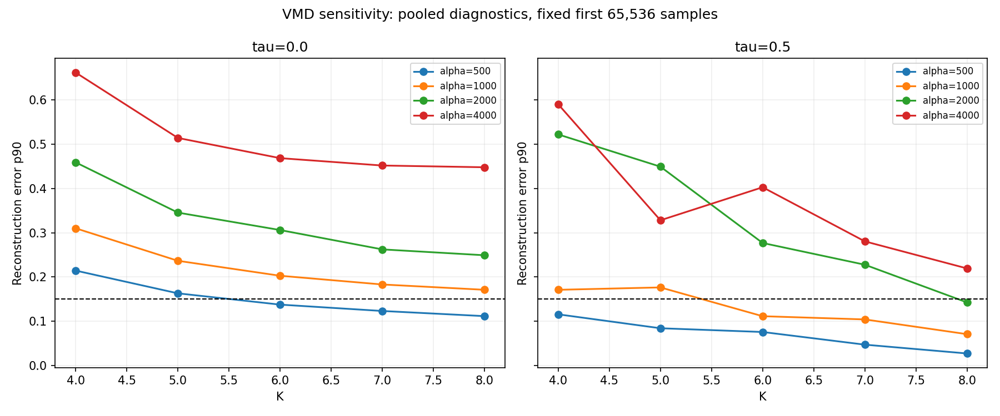
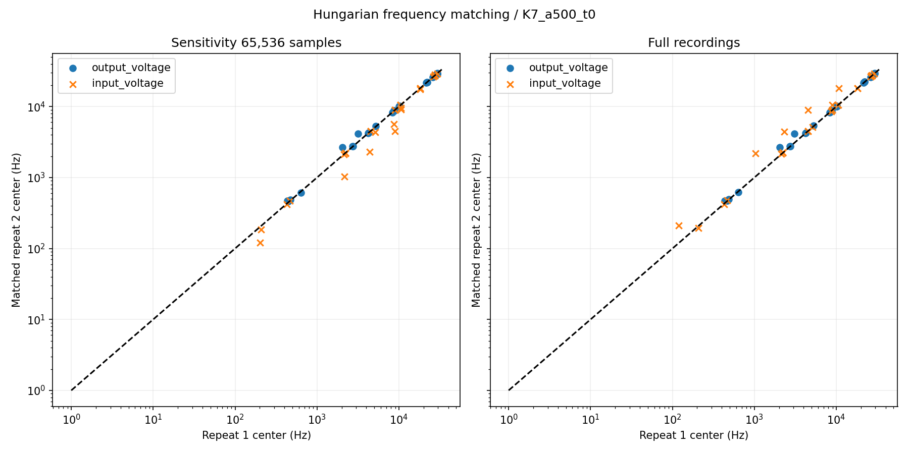
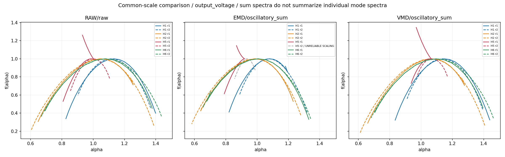

# PHM2009: corrected pilot experiment

Common scaling interval **64–512 samples**, actual selected scales 64–468, **17 points**.
Actual interval tương ứng 0.960–7.020 ms và 0.864 decade. Đây là local scaling window ngắn, chưa chứng minh asymptotic scaling.
Fq(s) của raw/EMD được tái sử dụng nguyên giá trị; chỉ fit lại. MF-DFA core theo Kantelhardt không thay đổi.

## Scaling validity và QC

QC cố định: ≥8 scales; min R²≥0,90; ≥80% q có R²≥0,95; ≥80% q có local-slope CV≤0,5; min h(q)>0,05. CV dùng std/abs(mean) của các slope giữa scales kề nhau. Ngưỡng là quy tắc pilot thực hành, không phải định lý kiểm định multifractality.
Range selection dùng tất cả 16 tín hiệu raw và không dùng class separation; mỗi tín hiệu phải đạt toàn bộ QC. Chỉ dải 64–512 đạt cho tất cả. Các dải/các q và local slope được giữ trong scaling_range_diagnostics.csv.

| Pipeline | QC pass / total | Cột 2 pass / total | Cột 1 pass / total |
|---|---:|---:|---:|
| RAW | 16/16 | 8/8 | 8/8 |
| EMD | 25/128 | 14/64 | 11/64 |
| VMD | 30/144 | 14/72 | 16/72 |

Các total EMD/VMD gồm từng mode, oscillatory_sum và residue; số pass từng loại có ở summaries/valid_component_summary.csv. Numerical arrays/feature invalid vẫn lưu để audit. Spectrum invalid luôn grey/dashed và ghi UNRELIABLE SCALING, không được dùng separation.

Spectrum-shape audit: 28 phổ scaling-valid có alpha(q) tăng ở ít nhất một bước hoặc f(alpha)>1. Các field shape warning chỉ audit, không thay đổi QC đã cố định trước selection. R² tốt chưa chứng minh tau concave hay multifractality vật lý; chiều rộng phổ hữu hạn có thể chịu bias từ fitting/Legendre derivative.



## VMD robustness và cấu hình cuối

Cấu hình chọn: **{'K': 7, 'alpha': 500, 'tau': 0.0}**, init=1, tol=1e-7; max_iter=1.000 ở sensitivity và 2.000 ở full recording.
Có 3/40 cấu hình eligible. Cấu hình chọn trên windows: convergence 100.0%; median repeat drift 0.54%; drift p90 27.14%; fraction matches trong ngưỡng 15% = 85.7%; reconstruction p90 12.31%. Median ổn định không có nghĩa mọi mode/repeat đều ổn định.
Theo lựa chọn người dùng: sensitivity dùng first 65.536 samples (~0,98 s) trên mỗi tín hiệu, toàn bộ 40 combinations K={4,5,6,7,8}, alpha={500,1000,2000,4000}, tau={0,0,5}. Hai kênh/tám recordings đều tham gia. Cấu hình chọn sau đó chạy trên toàn bộ dữ liệu gốc, không cắt file H5 r2.
Tiêu chí eligible: ≥90% hội tụ; reconstruction error p90≤0,15; median repeat center drift≤0,15; median duplicate fraction≤0,30; mean energy fraction của mỗi rank≥1e-4. Duplication dùng spectral-overlap cosine>0,8; đây là proxy số học, không chứng minh mode mixing vật lý.
Trong các cấu hình eligible, ưu tiên drift trung tâm nhỏ, ít duplication, reconstruction nhỏ, K thấp. Không dùng QC pass count, Δα, α0, Δh hoặc separation để chọn VMD.
Full-record confirmation: convergence 16/16; reconstruction median 6.20%, p90 12.27%, max 16.37%; repeat drift median 0.56%, matches within 15% 85.7%; pooled robustness pass = True.
Center matching giữa hai acquisitions dùng Hungarian assignment trên khoảng cách log-frequency, không đối chiếu mode chỉ vì cùng index. Dữ liệu pairing sử dụng acquisition membership, không sử dụng mức separation giữa classes.





## Descriptive separation, chỉ dùng valid spectra

Chỉ đánh giá khi cả hai recordings của mỗi điều kiện đều có scaling_valid và decomposition_valid. Với mode, dùng representative energy cao nhất trong các frequency bands cố định; yêu cầu tỷ số center lớn nhất/nhỏ nhất của bốn repeats≤1,5. Cùng index không được coi là cùng mode vật lý.

| Pipeline/component, cột 2 | H1–H2 | H2–H5 | H2–H6 |
|---|---|---|---|
| RAW/raw | delta_alpha, alpha0, delta_h | delta_alpha, alpha0, delta_h | alpha0 |
| EMD/oscillatory_sum | delta_alpha, alpha0, delta_h | không đủ phổ valid | alpha0 |
| VMD/oscillatory_sum | delta_alpha, alpha0, delta_h | delta_alpha, delta_h | alpha0 |

Toàn bộ comparisons theo frequency band/kênh nằm trong summaries/valid_state_pair_comparisons.csv; rows không evaluable chứa lý do và không có chỉ số separation.



| Pipeline/component, cột 2 | Evaluable feature/pair rows | Disjoint repeat ranges |
|---|---:|---:|
| RAW/raw | 9/9 | 7 |
| EMD/oscillatory_sum | 6/9 | 4 |
| VMD/oscillatory_sum | 9/9 | 6 |

Bảng này đối chiếu raw với tổng dao động; không gộp các mode spectra. Mode features có QC riêng và đối chiếu theo frequency bands trong CSV, vì vậy coverage khác nhau không được diễn giải thành thắng/thua giữa algorithms.

Trong pilot cột 2, Raw tách khoảng ở 7/9 feature–pair rows, VMD oscillatory_sum ở 6/9; EMD sum chỉ 6/9 rows evaluable và tách ở 4. Vì vậy so sánh raw/sum không hỗ trợ cải thiện separation của VMD so với Raw. Các VMD mode representatives valid ở band 0–1.000 Hz chỉ tách Δα/Δh cho H2–H5 và α0 cho H2–H6, vốn đã tách trong Raw; H1–H2 không có mode band đủ bốn phổ valid/matched. EMD không có mode band đủ điều kiện, nên chưa đủ căn cứ xếp hạng EMD và VMD theo individual modes.

Nhiều mode narrowband không đạt QC; mode coverage và dải tần giữa EMD/VMD khác nhau. Kết quả không hỗ trợ một tuyên bố VMD cải thiện tổng quát; đây là descriptive pilot evidence, không phải statistical evidence từ hai recordings/class.

## Feature values của các phổ valid

Toàn bộ Δα, α0, Δh từng recording/component ở features/mfdfa_features.csv, kèm scaling_valid và invalid_reason. Bảng dưới chỉ lấy raw hoặc oscillatory_sum, cột 2; dấu — nghĩa là invalid và không diễn giải feature.

| Condition/repeat | Pipeline | Δα | α0 | Δh |
|---|---|---:|---:|---:|
| H1 r1 | RAW | 0.57297 | 1.13204 | 0.32039 |
| H1 r2 | RAW | 0.46454 | 1.11521 | 0.27506 |
| H2 r1 | RAW | 0.60698 | 1.04874 | 0.40941 |
| H2 r2 | RAW | 0.78473 | 1.04238 | 0.47784 |
| H5 r1 | RAW | 0.19793 | 0.98698 | 0.09963 |
| H5 r2 | RAW | 0.25001 | 0.99956 | 0.13576 |
| H6 r1 | RAW | 0.68412 | 1.07511 | 0.45903 |
| H6 r2 | RAW | 0.76656 | 1.08127 | 0.51240 |
| H1 r1 | EMD | 0.37487 | 1.07976 | 0.22576 |
| H1 r2 | EMD | 0.43165 | 1.07523 | 0.23350 |
| H2 r1 | EMD | 0.59107 | 0.98842 | 0.38149 |
| H2 r2 | EMD | 0.69644 | 0.98250 | 0.42757 |
| H5 r1 | EMD | 0.12974 | 0.92007 | 0.05324 |
| H5 r2 | EMD | — | — | — |
| H6 r1 | EMD | 0.65048 | 1.00777 | 0.42167 |
| H6 r2 | EMD | 0.68704 | 1.00473 | 0.44731 |
| H1 r1 | VMD | 0.60414 | 1.14790 | 0.33346 |
| H1 r2 | VMD | 0.48248 | 1.13756 | 0.28235 |
| H2 r1 | VMD | 0.61835 | 1.06809 | 0.41598 |
| H2 r2 | VMD | 0.79680 | 1.06127 | 0.48467 |
| H5 r1 | VMD | 0.13065 | 1.05384 | 0.07382 |
| H5 r2 | VMD | 0.19378 | 1.07011 | 0.11615 |
| H6 r1 | VMD | 0.69077 | 1.09595 | 0.46307 |
| H6 r2 | VMD | 0.77959 | 1.10157 | 0.51842 |

## Decomposition validity và reconstruction

EMD giữ biến thể sifting thực hành của pilot: mode xấp xỉ, kiểm tra practical convergence và báo riêng strict IMF count condition. Không coi đó là benchmark EMD nghiêm ngặt. Dừng ở sáu mode; residual giữ phần thấp tần còn lại. Tính MF-DFA riêng trên mỗi mode, sum và residual, không cộng/trung bình các spectra.
VMD tau=0 là denoising, không bắt buộc tổng mode bằng raw; tau>0 có constraint và tiêu chí reconstruction riêng. Xem diagnostics/vmd_full_record_validation.csv để tách solver convergence, reconstruction và scaling validity.

Reconstruction error là ||x−sum(modes)||/||x|| trên full tín hiệu đã bỏ mean; constraint_error là residual relative trên miền Fourier của mirror extension, vì vậy hai chỉ số có thể khác nhau. Thêm residue thì khớp raw đã bỏ mean theo construction, nhưng identity này không có nghĩa riêng sum(modes) reconstruct tốt.

| Pipeline | Channel | Decomposition pass | Reconstruction median | Reconstruction max |
|---|---|---:|---:|---:|
| RAW | output_voltage | 8/8 | 0 | 0 |
| RAW | input_voltage | 8/8 | 0 | 0 |
| EMD | output_voltage | 8/8 | 0.240862 | 0.283826 |
| EMD | input_voltage | 8/8 | 0.429705 | 0.600841 |
| VMD | output_voltage | 8/8 | 0.0640976 | 0.163739 |
| VMD | input_voltage | 8/8 | 0.0547437 | 0.0840866 |

## Dataset và giới hạn nhận định

Tám PHM2009 Helical recordings: 50 Hz nominal operating speed, High load; sample rate 66.6667 kHz theo VidData. Cột 2 output voltage chính, cột 1 input voltage secondary; tachometer không phân tích MF-DFA.
**H2 = 24T chipped gear. H5 = 24T broken gear + bearing inner-race fault. H2–H5 KHÔNG cô lập riêng bearing contribution.** H1 healthy, H6 bent input shaft. Giữ nguyên 266.656 mẫu ở bảy file và 245.648 mẫu ở H5 r2.
Không được suy ra classification accuracy, statistical significance, causal bearing contribution, optimal configuration cho dataset khác, hoặc multifractality vật lý chỉ vì spectrum có chiều rộng. Sensitivity window và full-record validation phải được phân biệt.

## Reproducibility và output management

config/: nguồn/hash, QC, selected scaling, VMD grid và selected config. diagnostics/: per-q candidates, QC audit, grid modes/constraints/center matching, full-record validation. features/: numerical features và representatives. arrays/: Fq gốc và kết quả fit trên selected range, kể cả invalid. decompositions/vmd/: chỉ full decomposition của config cuối. figures/ và summaries/: plots/bảng cuối.
Không giữ full spectra/decompositions của mọi sensitivity combination. Scalar diagnostics đủ audit; windows và job caches có thể tái tạo từ raw + config và được dọn sau validation. step4 cũ cung cấp raw/EMD Fq và decomposition; chưa xóa những input generated mà script còn dùng.

Verification: 9 tests của refit/QC/mode metrics/label-independent selection/frequency matching/accelerator đều pass; validation.json xác nhận nguyên SHA256 raw, Fq raw/EMD bit-for-bit, tái tính QC/Legendre features và modes+residue khớp tín hiệu đã bỏ mean. output_cleanup.csv audit cache đã dọn, output_manifest.csv kiểm kê/hash các file còn lại.

```powershell
python -B result\test\step4_corrected\scripts\experiment.py scaling
python -B result\test\step4_corrected\scripts\vmd_sensitivity.py
python -B result\test\step4_corrected\scripts\experiment.py finalize
```
Optional fused ADMM runtime ở _runtime/ đã kiểm tra parity với code/core/vmd.py; NumPy FFT và công thức ADMM giữ nguyên. Source scripts/vmd_kernel.cpp được biên dịch bằng GCC với -O3 -std=c++17 -shared -static-libgcc -static-libstdc++; nếu DLL không có, scripts/vmd_accel.py dùng implementation NumPy gốc. diagnostics/accelerator_parity.json và tests.json lưu kiểm chứng.
Mỗi lần chạy overwrite trực tiếp cùng tên output; không sinh v2/final/corrected variants. Không sửa raw, metadata, papers hoặc code/core.
