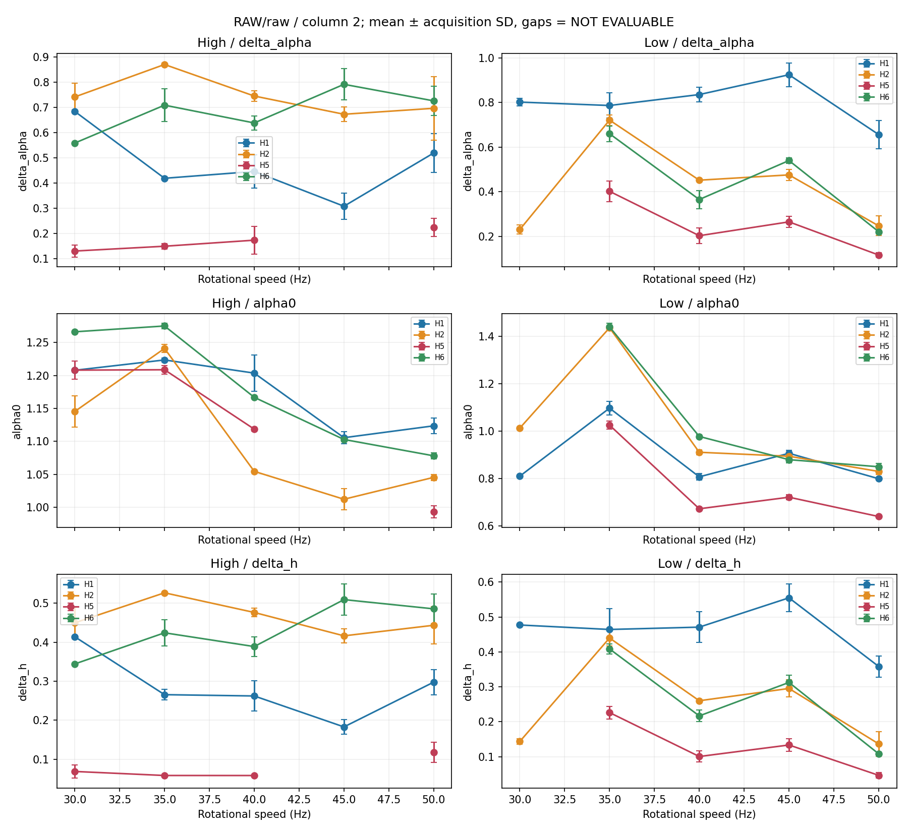
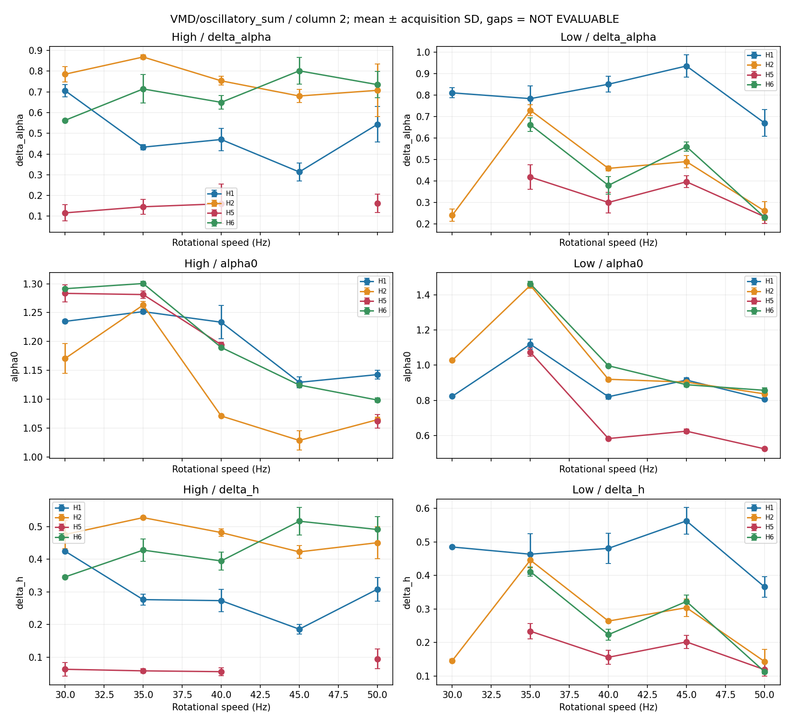
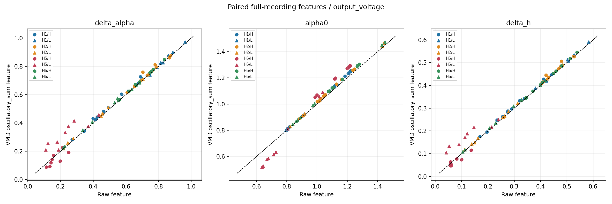
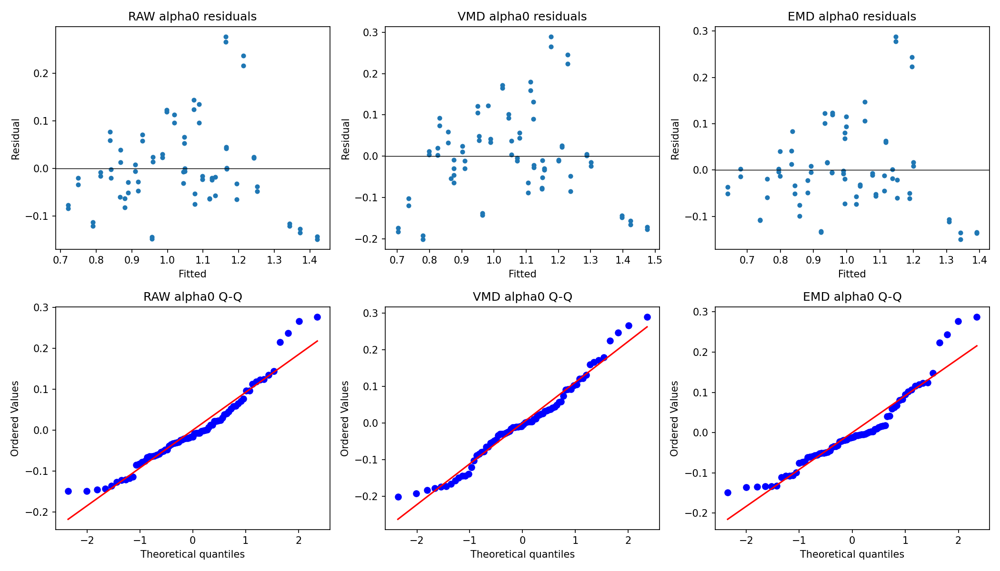

# STEP 5 — Operating-condition robustness

**80/80 Helical recordings**; missing=0, duplicates=0, unexpected=0. Hai acquisitions/cell, full length 245648–266656 samples (~3,685–4,000 s), 80 independent recording units / 160 channel signals. Không có windows dùng làm samples.
Cột 2 output voltage chính; cột 1 input voltage đối chiếu. H1 Healthy; H2 24T chipped gear; H5 24T broken gear + bearing inner-race fault; H6 bent input shaft. **H2–H5 không cô lập bearing contribution.**

## Configuration và separation validity

Snapshot config/locked_step4_configuration.json tham chiếu SHA256 các config/source Step 4 và VidData, không nhân bản implementation. q=-5…5 bước 0,5; DFA order=2; scales gốc 40 điểm; fit 64–512 samples (actual 64–468, 17 points). QC nguyên Step 4: min R²≥0,90; ≥80% q R²≥0,95; ≥80% local-slope CV≤0,5; min h(q)>0,05; ≥8 points. Không grid search, đổi range hay đổi QC.
VMD K=7, alpha=500, tau=0, DC=False, init=1, tol=1e-7, max_iter=2000. EMD practical approximation: sáu modes, max_siftings=200, energy SD≤0,2, envelope RMS ratio≤0,05, relative extrema mismatch≤0,005; giữ strict IMF audit riêng. Không coi EMD là benchmark IMF nghiêm ngặt.
Invalid arrays và numerical features lưu audit; valid_features.csv và mọi phân tích chỉ dùng analysis_valid = scaling_valid AND decomposition_valid. Shape-warning của Step 4 được giữ, không đổi thành QC mới; scaling pass không chứng minh multifractality vật lý.

| Pipeline | QC pass/all components | Cột 2 pass | Main raw/sum complete cells, cột 2 |
|---|---:|---:|---:|
| RAW | 151/160 | 75/80 | 37/40 |
| VMD | 266/1440 | 134/720 | 37/40 |
| EMD | 224/1280 | 119/640 | 36/40 |

Solver convergence/practical EMD convergence tách khỏi MF-DFA scaling QC; tau=0 VMD không buộc sum(modes)=raw. Bảng reconstruction dưới dùng ||x−sum(modes)||/||x|| trên tín hiệu đã bỏ mean. Mode+residue identity được kiểm tra riêng; identity theo construction không chứng minh reconstruction riêng sum tốt.

| Pipeline, cột 2 | Decomposition pass / recordings | Reconstruction median | max | Strict IMF pass |
|---|---:|---:|---:|---:|
| VMD | 80/80 | 6.83% | 16.52% | N/A |
| EMD | 80/80 | 21.29% | 29.15% | 0/80 |

## 1. Raw ổn định theo speed/load hay không?

Trajectory là mean ± sample SD của hai acquisitions ở cùng cell; normalized speed range=(max−min)/abs(mean qua 5 speeds); load effect=2|High−Low|/(|High|+|Low|). Thiếu một cell/không match thì toàn trajectory/load comparison ghi NOT EVALUABLE.

| Pipeline/feature, cột 2 raw/sum | Median speed normalized range | Median load relative difference | Fault / operating variation ratio |
|---|---:|---:|---:|
| RAW/delta_alpha | 34.0% (N=5/8) | 54.4% (N=17/20) | NE |
| RAW/alpha0 | 20.8% (N=5/8) | 19.8% (N=17/20) | NE |
| RAW/delta_h | 42.2% (N=5/8) | 56.8% (N=17/20) | NE |
| VMD/delta_alpha | 34.5% (N=5/8) | 52.6% (N=17/20) | NE |
| VMD/alpha0 | 20.9% (N=5/8) | 21.0% (N=17/20) | NE |
| VMD/delta_h | 41.7% (N=5/8) | 55.1% (N=17/20) | NE |
| EMD/delta_alpha | 50.5% (N=5/8) | 53.3% (N=16/20) | NE |
| EMD/alpha0 | 22.4% (N=5/8) | 19.6% (N=16/20) | NE |
| EMD/delta_h | 59.1% (N=5/8) | 62.1% (N=16/20) | NE |

Fault/operating ratio = median absolute between-fault mean difference tại matched speed/load / median within-fault SD của 10 operating-cell means. Đây là descriptive scale ratio, không phải causal variance decomposition; >1 nghĩa fault gap lớn hơn typical operating SD theo định nghĩa này.

Full-grid ratio NE nghĩa chưa có đủ cả 10 conditions valid cho cả bốn states, không có nghĩa fault effect bằng zero. Bổ sung bảng dưới trên common observed operating grid có đủ bốn trạng thái; inclusion chỉ theo validity/matching, không theo separation. Bảng partial-grid này không thay rule/verdict full-grid đã khai báo.

| Pipeline/feature, cột 2 | Common operating cells / 10 | Partial-grid fault / operating SD ratio |
|---|---:|---:|
| RAW/delta_alpha | 8/10 | 1.558 |
| RAW/alpha0 | 8/10 | 0.325 |
| RAW/delta_h | 8/10 | 1.704 |
| VMD/delta_alpha | 8/10 | 1.604 |
| VMD/alpha0 | 8/10 | 0.287 |
| VMD/delta_h | 8/10 | 1.846 |
| EMD/delta_alpha | 7/10 | 1.725 |
| EMD/alpha0 | 7/10 | 0.438 |
| EMD/delta_h | 7/10 | 1.836 |

matched_operating_grid_effects.csv ghi rõ conditions, source recordings và scope; không suy rộng những cells bị QC loại và không interpolate chúng.





## 2. Within-condition separation và generalization Step 4

Sáu fault pairs × 10 operating conditions × ba features; disjoint acquisition ranges là mô tả hai repeats, không phải accuracy hoặc significance. Direction retention so với 50 Hz/High và mọi NOT EVALUABLE được giữ ở within_condition_separation.csv.

| Pipeline/feature, cột 2 raw/sum | Evaluable pairs / 60 | Disjoint fraction | Step 4 disjoint retained ở conditions khác |
|---|---:|---:|---:|
| RAW/delta_alpha | 52/60 | 96.2% | 73.7% (38 comparisons) |
| RAW/alpha0 | 52/60 | 90.4% | 63.0% (46 comparisons) |
| RAW/delta_h | 52/60 | 92.3% | 73.7% (38 comparisons) |
| VMD/delta_alpha | 52/60 | 90.4% | 68.4% (38 comparisons) |
| VMD/alpha0 | 52/60 | 88.5% | 53.8% (39 comparisons) |
| VMD/delta_h | 52/60 | 88.5% | 68.4% (38 comparisons) |
| EMD/delta_alpha | 49/60 | 91.8% | 35.3% (17 comparisons) |
| EMD/alpha0 | 49/60 | 85.7% | 36.0% (25 comparisons) |
| EMD/delta_h | 49/60 | 89.8% | 35.3% (17 comparisons) |

## 3. Raw vs VMD: preserve, improve hay mất thông tin?

| Feature, cột 2 | Paired N | Correlation | Median relative Raw–VMD difference |
|---|---:|---:|---:|
| delta_alpha | 75 | 0.9903 | 2.5% |
| alpha0 | 75 | 0.9907 | 1.9% |
| delta_h | 75 | 0.9935 | 2.2% |



Correlation cao riêng nó không chứng minh improvement. So sánh giảm sensitivity/tăng separation phải dùng cùng cells valid ở cả Raw và VMD; bảng dưới giữ intersection trước khi tính descriptive rates.

| Feature | Common evaluable pair comparisons | Raw disjoint | VMD disjoint | Median speed-range ratio VMD/Raw | Median load-effect ratio VMD/Raw |
|---|---:|---:|---:|---:|---:|
| delta_alpha | 52 | 96.2% | 90.4% | 0.979 | 0.967 |
| alpha0 | 52 | 90.4% | 88.5% | 1.009 | 1.040 |
| delta_h | 52 | 92.3% | 88.5% | 0.987 | 0.973 |

**Raw–VMD interpretation: B: mostly preserves Raw representation, with feature-specific changes; no consistent A.** Đây là mô tả dữ liệu hiện có; không tối ưu pipeline theo kết quả.

## 4. Individual frequency bands và EMD coverage

Frequency bands cố định Step 4; chọn mode energy lớn nhất trong band trước QC; không dùng nhãn để match. Matching requires all two/four repeat centers ratio≤1,5; across-speed/load summaries cần cùng compatibility. Same rank không được coi là same physical mode. Center matching và coverage đều có audit; thiếu valid/matched modes ghi NOT EVALUABLE.

| Pipeline/band, cột 2 | Evaluable cells / 40 | Evaluable feature–pair rows / 180 | Disjoint rows |
|---|---:|---:|---:|
| VMD/0–1000 Hz | 23/40 | 72/180 | 62 |
| VMD/1000–4000 Hz | 2/40 | 0/180 | 0 |
| VMD/4000–10000 Hz | 0/40 | 0/180 | 0 |
| VMD/10000–20000 Hz | 0/40 | 0/180 | 0 |
| VMD/20000–33334 Hz | 0/40 | 0/180 | 0 |
| EMD/0–1000 Hz | 0/40 | 0/180 | 0 |
| EMD/1000–4000 Hz | 2/40 | 0/180 | 0 |
| EMD/4000–10000 Hz | 1/40 | 0/180 | 0 |
| EMD/10000–20000 Hz | 0/40 | 0/180 | 0 |
| EMD/20000–33334 Hz | 0/40 | 0/180 | 0 |

Individual VMD bands có 3 matched descriptive feature–pair cases tách khoảng khi Raw chưa tách; xem individual_bands_vs_raw.csv. Đây là sparse band-specific evidence, không chứng minh thông tin mới thống kê hoặc improvement tổng quát. EMD individual-mode coverage phải đánh giá theo bảng; approximate EMD và VMD không được xếp hạng bằng tổng số mode pass khác nhau.

## 5. Factorial exploration và inference

Categorical fault + speed + load dùng sum-to-zero orthogonal contrasts. Full fault*speed*load chỉ fit nếu đủ 40 cells, full rank và ≥20 residual degrees of freedom. Additive partial η² = incremental SS/(incremental SS+residual SS); các partial η² không cộng thành tổng variance. Interactions kiểm tra conditional terms của full model. Không diễn giải additive main effect như causal effect khi có interactions.
OLS/HC3 covariance và null-imposed Rademacher wild bootstrap 1.999 draws, seed 6509, HC2-scaled reduced-model residuals, studentized HC3 Wald. HC3/wild p là exploratory; classical p chỉ reference. BH adjustment tính riêng mỗi channel trên toàn family models/features/representations/terms. Không có package cài thêm; NumPy/SciPy implementation và behavioral tests được lưu.
Shapiro residuals, heteroskedasticity LM và Q-Q/fitted-residual plot giữ trong diagnostics. Assumptions tests với 2 repeats/cell có power hạn chế; independence là thiết kế người dùng quy định, chưa kiểm chứng empirically. Robust inference giảm lệ thuộc normal/homoskedastic assumptions nhưng không cứu confounding, sparse coverage hay pseudo-replication.

| Pipeline/feature, cột 2 | Additive partial η² fault | speed | load | Full interaction availability |
|---|---:|---:|---:|---|
| RAW/delta_alpha | 0.490 | 0.101 | 0.015 | NOT EVALUABLE |
| RAW/alpha0 | 0.289 | 0.622 | 0.554 | NOT EVALUABLE |
| RAW/delta_h | 0.517 | 0.105 | 0.034 | NOT EVALUABLE |
| VMD/delta_alpha | 0.476 | 0.080 | 0.002 | NOT EVALUABLE |
| VMD/alpha0 | 0.241 | 0.580 | 0.557 | NOT EVALUABLE |
| VMD/delta_h | 0.501 | 0.084 | 0.013 | NOT EVALUABLE |
| EMD/delta_alpha | 0.468 | 0.067 | 0.032 | NOT EVALUABLE |
| EMD/alpha0 | 0.359 | 0.651 | 0.516 | NOT EVALUABLE |
| EMD/delta_h | 0.468 | 0.076 | 0.061 | NOT EVALUABLE |

P-values, robust statistics, effect sizes, source recordings và reasons trong factorial_effects.csv. Descriptive repeat-range separation tách rõ khỏi inferential p-values.

| Pipeline/feature, cột 2 | Wild p BH fault | speed | load |
|---|---:|---:|---:|
| RAW/delta_alpha | 0.0010 | 0.2423 | 0.3856 |
| RAW/alpha0 | 0.0019 | 0.0010 | 0.0010 |
| RAW/delta_h | 0.0010 | 0.2414 | 0.2423 |
| VMD/delta_alpha | 0.0010 | 0.2952 | 0.7650 |
| VMD/alpha0 | 0.0054 | 0.0010 | 0.0010 |
| VMD/delta_h | 0.0010 | 0.2867 | 0.4066 |
| EMD/delta_alpha | 0.0010 | 0.3527 | 0.2761 |
| EMD/alpha0 | 0.0010 | 0.0010 | 0.0010 |
| EMD/delta_h | 0.0010 | 0.3005 | 0.1240 |

Các p trên là exploratory BH-adjusted, không chứng minh classification performance hay causal effects. Interaction effect sizes và wild/HC3/classical p của full model có ở cùng CSV; nếu full model NOT EVALUABLE thì không thay bằng một model đã chọn theo separation.



## 6. Những kết luận chưa được phép đưa ra

Không classification accuracy, không causal bearing-specific effect H2–H5, không khẳng định healthy/fault separability ở mọi gearbox/dataset, không chứng minh physical multifractality từ một local scaling range <1 decade, không coi hai acquisitions/class/cell là statistical classification evidence. Fixed-sample scaling cũng thay đổi số vòng quay cơ học tương ứng khi speed đổi; đây là một phần robustness challenge và không được sửa range để cứu kết quả.

## Reproducibility và audit

recording_inventory.csv chứa original SHA256, parsing state/speed/load/repeat, sample count/duration/channels. locked_step4_configuration.json chứa snapshot và dependency hashes. features/mfdfa_features.csv và diagnostics/mfdfa_quality_control.csv gồm invalid; features/valid_features.csv chỉ valid. arrays/: complete Fq/h/tau/alpha/f/QC, hoặc reference Step 4 cho baseline. Recording JSON chứa solver/sifting diagnostics, reconstruction identity và scalar mode metrics; không giữ full decomposition arrays có thể regenerate.
Mọi descriptive/factorial summary có source_recordings để trace. 50 Hz/High dùng lại arrays đã validated của Step 4; phụ thuộc này giữ nguyên. output_cleanup.csv audit caches xóa sau validation; output_manifest.csv liệt kê/hash outputs.

```powershell
python -B result\test\step5\scripts\pipeline.py
python -B result\test\step5\scripts\tests.py
python -B result\test\step5\scripts\analysis.py
```

Method references: [SciPy Shapiro](https://docs.scipy.org/doc/scipy/reference/generated/scipy.stats.shapiro.html), [HC3/ANOVA guidance](https://www.statsmodels.org/stable/generated/statsmodels.stats.anova.anova_lm.html), [Davidson–Flachaire wild bootstrap](https://www.econ.queensu.ca/research/working-papers/1000). Không thay đổi configuration từ những analysis results.


## Trả lời trực tiếp về generalization

Trong dữ liệu này, Raw Δα/Δh giữ fault association mạnh hơn main speed/load effects ở additive model; α0 chịu ảnh hưởng speed/load lớn hơn fault (xem partial η²). Tuy vậy tuyệt đối các feature thay đổi theo conditions, và direction/separation của baseline chỉ được retained một phần. Vì thế fault information vẫn hiện diện, nhưng không thể coi feature là operating-condition invariant.
Kết quả 50 Hz/High không tự động áp dụng cho các operating conditions khác. Retention table trên đo chính các separation/direction của baseline trên conditions còn lại; unavailable comparisons được báo explicit, không được coi là retained.
Fault-state variation phải đọc đồng thời với normalized speed/load changes và factorial partial effects. Sự tồn tại fault signal trong một số matched cells không đồng nghĩa invariant feature qua speed/load. Chỉ decision ROBUST mới đáp ứng descriptive robustness rule đã khai báo; CONDITION-DEPENDENT nghĩa kết quả fault mang tính điều kiện; NOT ROBUST nghĩa fault/operating ratio và separation thấp theo rule.
Raw–VMD paired summary phía trên trả lời riêng preservation, sensitivity và separation trên cùng recording/cells. Individual-band extra cases chỉ là candidates cho phase độc lập sau này; không dùng chúng để tối ưu lại Step 5 hoặc diễn giải riêng bearing contribution.

## Figures bổ sung

[Feature distributions](figures/feature_distributions.png) · [Primary heatmaps](figures/feature_heatmaps_output_voltage.png) · [Primary QC coverage](figures/qc_coverage_output_voltage.png) · [Secondary heatmaps](figures/feature_heatmaps_input_voltage.png) · [Secondary QC coverage](figures/qc_coverage_input_voltage.png)

[EMD feature trajectories](figures/feature_vs_speed_emd.png)

## Quyết định cuối Step 5

Decision rules mô tả được ghi trong config/analysis_rules.json trước khi tổng hợp dữ liệu; không phải universal scientific cutoff. Đánh giá primary raw/sum representation; individual bands có coverage riêng.

| Pipeline | Decision | Evidence summary |
|---|---|---|
| RAW | **CONDITION-DEPENDENT** | 37/40 complete cells; full-grid effects evaluable for 0/3 features; 0/3 meet ROBUST rule, 0/3 meet NOT ROBUST rule; strict verdict limited by missing/invalid operating cells |
| VMD | **CONDITION-DEPENDENT** | 37/40 complete cells; full-grid effects evaluable for 0/3 features; 0/3 meet ROBUST rule, 0/3 meet NOT ROBUST rule; strict verdict limited by missing/invalid operating cells |
| EMD | **CONDITION-DEPENDENT** | 36/40 complete cells; full-grid effects evaluable for 0/3 features; 0/3 meet ROBUST rule, 0/3 meet NOT ROBUST rule; strict verdict limited by missing/invalid operating cells |
